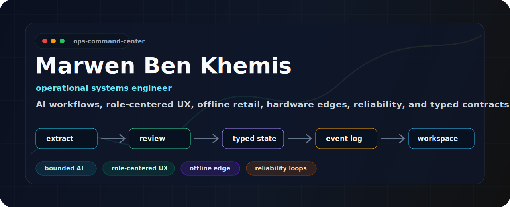

<p align="center">
  
</p>

<p align="center">
  <a href="https://github.com/marwenbk/engineering-field-notes"></a>
  <a href="https://www.linkedin.com/in/marwen-ben-khemis-113809118"></a>
  <a href="https://medium.com/@marwanbk2000"></a>
  <a href="mailto:marwanbk2000@gmail.com"></a>
</p>

## What I Build

I build operational software where messy real-world workflows become typed, observable, reliable systems.

<table>
<tr>
<td width="50%" valign="top">

### Bounded AI Systems

Model extraction where ambiguity exists. Deterministic authority where business truth matters.

`OCR` `typed snapshots` `human review` `event gates` `deterministic parsing`

</td>
<td width="50%" valign="top">

### Role-Centered UX

Interfaces designed around responsibility, risk, permissions, timing, and next action.

`operator consoles` `admin workspaces` `workflow state` `error prevention`

</td>
</tr>
<tr>
<td width="50%" valign="top">

### Offline And Edge Retail

Checkout flows, local queues, stale-auth handling, receipt printers, scanners, and scale integrations.

`Flutter` `local state` `sync loops` `ESC/POS` `hardware protocols`

</td>
<td width="50%" valign="top">

### Reliability And Delivery

Systems that expose degraded state, recover in background loops, and encode domain failures in CI.

`event logs` `freshness` `workers` `GitHub Actions` `PM2` `Ansible`

</td>
</tr>
</table>

## Public Proof

[**engineering-field-notes**](https://github.com/marwenbk/engineering-field-notes) is where I turn private production lessons into public-safe engineering notes.

Current notes cover:

- **The model extracts; the system decides** - AI boundaries for operational systems
- **Human review is not a text box** - HITL as typed state
- **Role-centered UX** - designing big interfaces around responsibility
- **Shadow-run, then delete** - safer migration and cleanup
- **A green API ping does not mean the operation is alive** - reliability beyond `/health`
- **Offline POS is queue ownership** - resilient checkout as distributed systems work
- **The revert wave** - undoing cleanup without losing correctness

Everything there is synthetic and public-safe: no private screenshots, customer data, hostnames, credentials, raw payloads, or internal system names.

## Operating Model

```txt
document / device / user action
          |
          v
extract ambiguity -> confirm responsibility -> produce typed state
          |                    |                     |
          v                    v                     v
 deterministic rules      role-centered UI       append-only events
          |                    |                     |
          +-----------> reliable operator workflow <-+
```

## Selected Systems

| System shape | What it proves |
|---|---|
| Retail POS ecosystem | Offline-first mobile, real-time sync, generated SDKs, order/payment flows, printers, barcode, scale integration |
| AI-assisted document workflow | OCR/model extraction, human review gates, typed snapshots, event logs, background workers, operator dashboards |
| Multi-tenant business platform | WebAuthn/passkeys, TOTP, JWT auth, real-time inventory, Flutter clients, health-checked deploys |
| Engineering field notes | Public writing around architecture, reliability, product judgment, role-centered UX, and AI boundaries |

## Engineering Taste

```txt
prefer deterministic parsing when input is structured
keep model calls where ambiguity is real
make degraded state explicit
turn review into typed data
design around roles, not generic users
encode domain failures in CI
delete obsolete paths after parity is proven
```

## Stack

<p>
  
  
  
  
  
  
  
  
  
  
  
</p>

## GitHub Trace

<p align="center">
  
  
</p>

<p align="center">
  
</p>

<p align="center">
  
</p>
